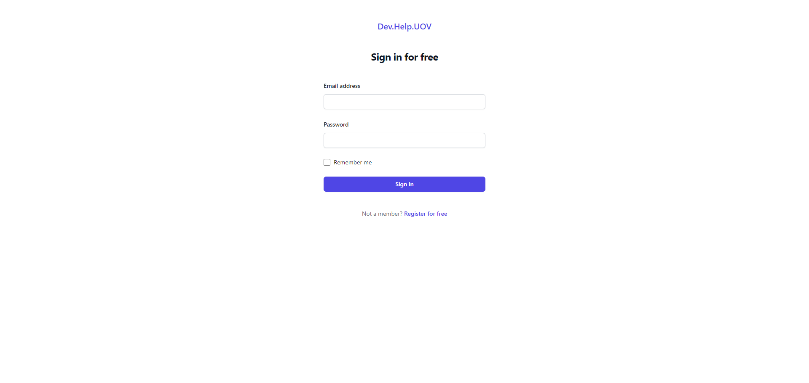
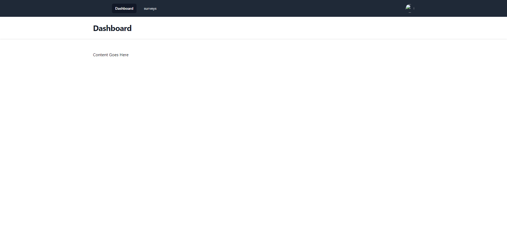
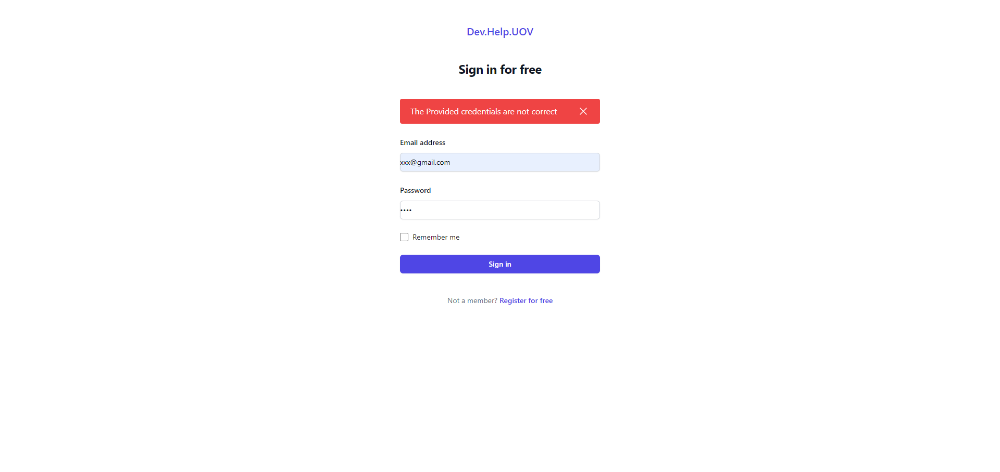
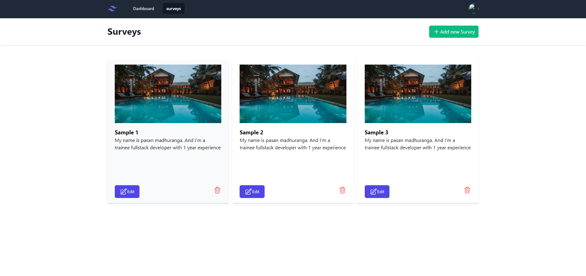
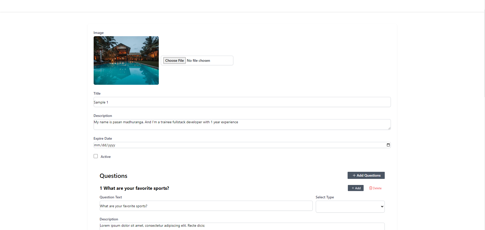
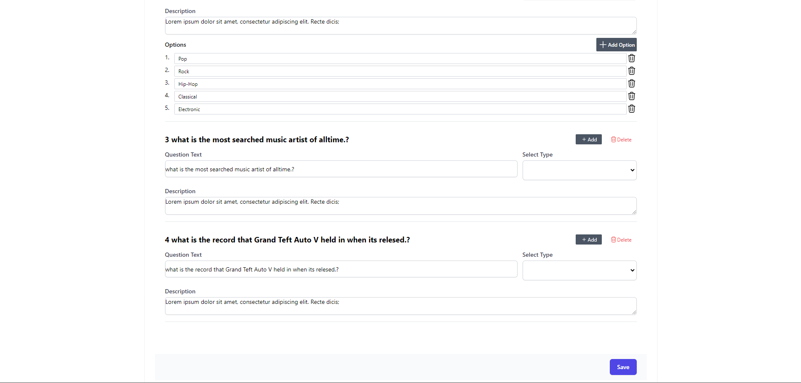

About
This repository contains the source code for a full-stack quiz application developed using MySQL, Laravel, Vite, Vue, and Tailwind CSS. The application is designed to provide a seamless and interactive quiz-taking experience, with a focus on modern web technologies and a responsive user interface.

Features
User Authentication: Secure user authentication system on features.
Quiz Creation: Easily create various question types.
Real-time Updates: real-time updates during quiz sessions.
Responsive Design: A responsive user interface that ensures an optimal viewing experience across devices.

Tech Stack

Frontend:
Vue: 
Vite:
Tailwind CSS:

Backend:
Laravel: 
MySQL:

